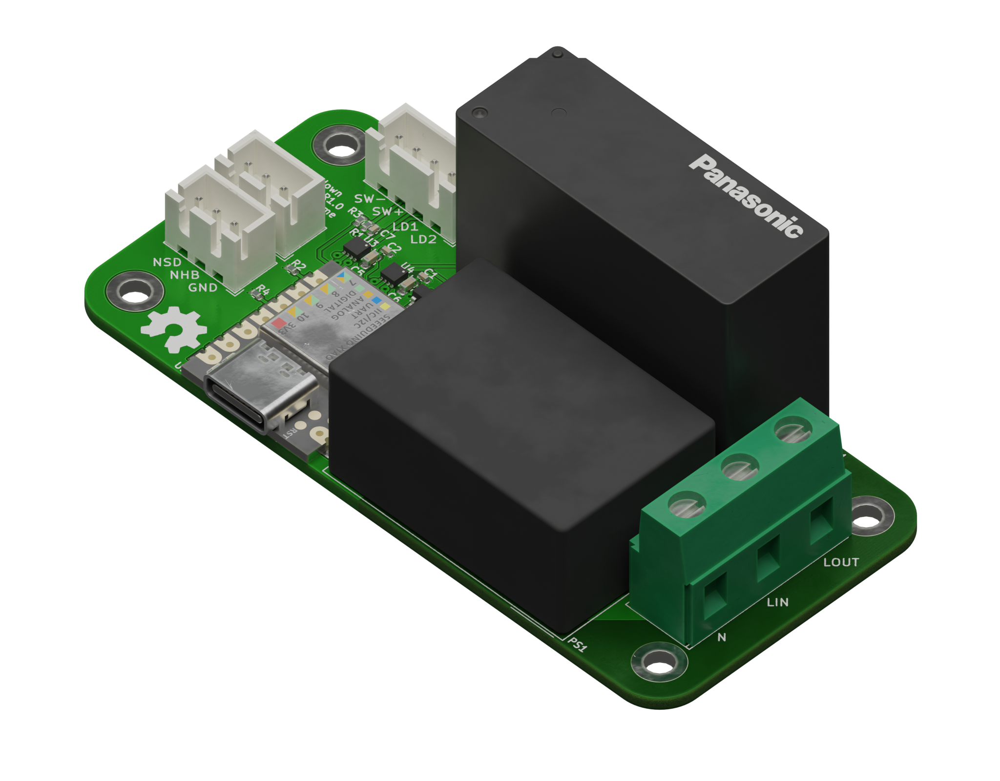

# Shutdown Manager Mainboard

This is a board for switching the AC mains input in machines such as 3D printers or CNC machines.

It is designed to be controlled by a push button switch with built-in dual color LEDs. An on-board LED driver controls these LEDs and different light patterns indicate the current system status.

The board has connections for two "nodes". These are external devices that require a safe shutdown procedure, such as a Raspberry Pi. It will trigger a shutdown of the nodes and will not turn off the power until they have completely shut down.

It is specifically designed to handle high inrush currents from SMPSs, which can cause normal relays to have their contacts weld together.

## I/O

### Nodes

| Pin | Function                                                                                     |
|-----|----------------------------------------------------------------------------------------------|
| NSD | Node Shutdown - is repeatedly cycled low and high to trigger a shutdown of external devices  |
| NHB | Node Heart Beat - should be driven HIGH, when a node is running and LOW when it's shut down. |

For an easy way to connect a Raspberry Pi see [this repo.](https://github.com/testudor/shutdown-manager-rpi-node)

### Push button switch

| Pin     | Function                                   |
|---------|--------------------------------------------|
| SW-/SW+ | Connected to the power switch.             |
| LD1/LD2 | Connected to the switches' dual color LED. |

I can recommend the ONPOW GQ19F-10E/RG/12/S, however any push button switch with 12V dual color LEDs should work. By dual color I mean LEDs which change their color based on polarity.

## Assembly

All necessary files can be found in the release section. They are compatible with the usual fab houses.

To use the full 16A this board was designed for, get 2oz PCBs or liberally coat the mains voltage traces on the bottom in solder.

I'm leaving these instructions intentionally vague as this is *NOT* a beginner's project. The more experienced should know what to do.

## Firmware

This board requires firmware to be flashed and configured. For details see [this repo.](https://github.com/testudor/shutdown-manager-firmware)

## Disclaimer

**WARNING:**

This board was designed to the best of my knowledge, but I am *NOT* an electrical engineer. If you decide to build this, I am not liable for damages or harm to yourself or anyone else.